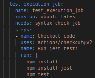
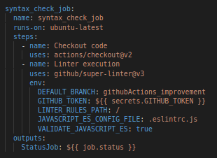
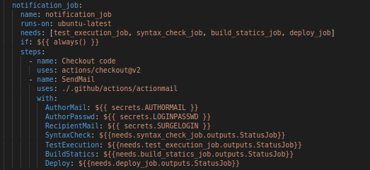

# Tabla de contenidos
- [Teoria](#Teoria)
    - [¿Que es Github Actions?](#Github-Actions)
        - [¿Que es un Workflow?](#Workflow)
        - [¿Que son los Jobs?](#Jobs)
        - [¿Que son los Steps?](#Steps)
        - [¿Que son las Actions?](#Actions)
        - [¿Que es un Runner?](#Runner)
- [Start](#Start)
    - [Estructura inicial](#Estructura-inicial)
    - [Syntax](#Syntax)
    - [Tests](#Tests)
    - [Statics](#Statics)
    - [Deploy](#Deploy)
        - [Configuracion](#Deploy-Configuracion)
        - [Job](#Deploy-Job)
    - [Notification](#Notification)
        - [Job](#Notification-Job)
         - [Action](#Action)
            - [Estructura](#Estructura)
            - [Configuracion](#Action-Configuracion)
            - [YML](#YML)
            - [JS](#JS)
    - [Readme](#Readme)

# Teoria
Antes de comenzar deberiamos entender los siguientes conceptos:

## Github Actions
Permite crear flujos de trabajo ([Workflow](#Workflow)) que se pueden utilizar para compilar, probar y desplegar código, dando la posibilidad de crear flujos de integración y despliegue continuo dentro del propio repositorio de git.

Los flujos de trabajo tienen que contener al menos un [job](#Jobs). Estos incluyen una serie de pasos que ejecutan tareas individuales que pueden ser acciones o comandos. Un flujo de trabajo puede comenzar por distintos eventos que suceden dentro de GitHub, como un push al repositorio o un pull request.

En este tutorial vamos a crear un workflow para ejecutar las pruebas unitarias de un proyecto Laravel y realizar el despliegue por ssh a un servidor.

### Workflow
Procedimiento automatizado que agregamos a un repositorio. Se compone de uno o más [jobs](#Jobs) y pueden ser activados por eventos.

### Jobs
Conjunto de [steps](#Steps) que se ejecutan en el mismo runner. Por defecto, los jobs de un workflow se ejecutan en paralelo

### Steps 
Tarea individual que se ejecuta dentro de un [job](#Jobs). Puede ser un action o un comando shell.

### Actions
Comandos independientes que se combinan formando [steps](#Steps). Son el bloque de construccion protátil mas pequeño de un flujo de trabajo.

### Runner
Servidor que tiene instalada la aplicación de ejecución de [Github Actions](#Github-Actions)

# Start

## Estructura inicial

<table>
<tr>
    <td>
     
        
    </td>
    <td>
      Primero crearemos la estructura inicial del proyecto  
    es decir añadiremos una capreta .github   
    con dos subcarpetas dentro, actions y workflows.   
    Dentro de esta ultima crearemos un archivo llamado Bingo_Workflow.yml
    </td>
</tr>
</table>

## Workflow

<table>
<tr>
    <td>
         
    </td>
    <td>
         En nuestro workflow Bingo_Workflow.yml haremos lo siguiente:  
         - Primero le asignaremos un nombre  
         - Segundo le diremos que se ejecute cuando se suba a la   la rama githubActions_improvement
    </td>
</tr>
</table>

Cabe destacar que todos nuestros jobs tendran como valor nombre su nombre de job y todos se ejecutaran en un runner ubuntu-lastest

## Syntax
Este [job](#Jobs) se encargara de verificar que la sintáxis utilizada és correcta en los ficheros javascript.

<table>
<tr>
    <td>
        
    </td>
    <td>
        Primero crearemos el objeto job para   poder ir haciendo uno detras de otro.   El primero será syntax_check_job    al cual le asignaremos varios seteps:    
        - Checkout code: Obtendrá el código fuente    del proyecto ejecutando la action actions/checkout@v2 
        - Linter execution: Ejecutará la action   github/super-linter@v3  con estas variables de entorno.
    </td>
</tr>
<tr>
    <td>
         Una vez subidos estos cambios a nuestro   repositorio podremos comprobar que     todo funciona correctamente
    </td>
    <td>
        
    </td>
</tr>
</table>

## Tests
Este [job](#Jobs) se encargara de ejecutar los tests y verificar que todos funcionan como se esperaba.

<table>
<tr>
    <td>
        
    </td>
    <td>
       Añadimos a jobs test_execution_job,    al cual le indicaremos que se ejecute   tras el job de linter,  ademas de  varios seteps:   
        - Checkout code: Obtendrá el código fuente    del proyecto ejecutando la action actions/checkout@v2 
        - Run jest test: Instalara lo necesario y ejecutará los tests
    </td>
</tr>
<tr>
    <td>
    Una vez subidos estos cambios a nuestro   repositorio podremos comprobar que     todo funciona correctamente
    </td>
    <td>
            
    </td>
</tr>
</table>

## Statics
Este [job](#Jobs) se encargara de realizar el proceso de compilado del proyecto.

<table>
<tr>
    <td>
        
    </td>
    <td>
       Añadimos a jobs test_execution_job,    al cual le indicaremos que se ejecute   tras los jobs de linter, y test  ademas de  varios seteps:   
        - Checkout code: Obtendrá el código fuente    del proyecto ejecutando la action actions/checkout@v2 
        - build: Instalara lo necesario y ejecutará un run builDev  
        - artifact: Compilara el codigo de la app a el directorio   indicado, en nuestro caso dist
    </td>
</tr>
<tr>
    <td>
    Una vez subidos estos cambios a nuestro   repositorio podremos comprobar que     todo funciona correctamente
    </td>
    <td>
            
    </td>
</tr>
</table>

## Deploy
En este [job](#Jobs) partiendo de los estáticos generados en el job anterior desplegará el proyecto en surge.sh.

### Deploy Configuracion
Antes de empezar con este job debemos configurar algunas cosas.

Primero debemos instalar surge de manera global &nbsp; ->  &nbsp;
` sudo npm install -g surge `

Ahora ejecutaremos &nbsp; ->  &nbsp;` surge` 

<table>
<tr>
    <td>
        
    </td>
    <td>
     - Añadimos un email y un password  
     - Elegimos la direccion de nuestro proyecto   (si ejecutamos el comando en el directorio se pondrá automaticamente )  
     - Indicamos un dominio
    </td>
</tr>
</table>

Ahora ejecutaremos ` surge token ` lo cual nos mostrara nuestro token. Posteriromente iremos a nuestro proyecto de github -> Settings -> Secrets. Una vez alli crearemos un nuevo secret y elegiremos un valor para el correo y pondremos nuestro correo. En mi caso elegí  SURGELOGIN. Una vez creado este, crearemos un nuevo secret pero esta vez con el token obtenido anteriormente, en mi caso lo llame SURGETOKEN.   

### Deploy Job
<table>
<tr>
    <td>
        
    </td>
    <td>
       Añadimos a jobs deploy_job,    al cual le indicaremos que se ejecute   tras el job de statics ademas de  varios seteps:   
        - Download: Obtendrá el código fuente    del proyecto (en este caso de dist) ejecutando la action actions/checkout@v2 
        - To Deploy: Desplegará este codigo en nuestro dominio indicado con nuestros secrets indicados anteriromente.
    </td>
</tr>
<tr>
    <td>
    Una vez subidos estos cambios a nuestro   repositorio podremos comprobar que     todo funciona correctamente
    </td>
    <td>
            
    </td>
</tr>
</table>

## Notification
Este [job](#Jobs) se encargara de ejecutar una action que se encargará de enviar un correo.

### Notification Job
<table>
<tr>
    <td>
        
    </td>
    <td>
      Como observamos en este job,   hemos añadido un output llamado StatusJob,   el cual devuelve el estado del job.  
      Esto lo repetiremos en todos los demas jobs (menos en el de notification_job).
    </td>
</tr>
<tr>
    <td>
        
    </td>
    <td>
       Añadimos a jobs notification_job,    al cual le indicaremos que se ejecute   tras todos los anteriores jobs, que se ejecute siempre aunque algun job haya fallado   ademas de crear varios steps:   
        - Checkout code: Obtendrá el código fuente    del proyecto ejecutando la action actions/checkout@v2 
        - SendMail: Ejecutara la action de la dirección indicada con los datos indicados, en nuestro caso:  
        - Las credenciales del correo emisor  (Las cuales guardaremos en dos secrets nuevos de github como hemos mostrado anteriormente con surge). 
        - El correo receptor. (En mi caso he utilizado el mismo correo que en el surge, por eso el mismo secret) 
        - Los estados de los anteriores jobs. 
    </td>
</tr>
</table>

### Action

#### Estructura

<table>
<tr>
    <td>
     
        
    </td>
    <td>
      Primero crearemos la estructura de la acction  
    es decir dentro de nuestra carpeta actions   
    crearemos una subcarpetas dentro con el   nombre de nuestra action, en mi caso actionmail  
    Dentro de esta ultima crearemos un action.yml e index.js 
    </td>
</tr>
</table>

#### Action Configuracion

Ahora nos situaremos en el directorio actionmail y ejecutaremos &nbsp; ` npm init `  &nbsp; asi se nos creará nuestro package.json. Posteriormente ejecutaremos  &nbsp; `npm install`,  &nbsp; ` npm install @actions/core `, &nbsp; `npm install nodemailer` &nbsp; y &nbsp;`npm install -g @vercel/ncc` &nbsp; para posteriormente ejecutarlo y que así nos cree el dist que se muestra en la imagen

#### YML 
<table>
<tr>
    <td>
     
        
    </td>
    <td>
        - Primero añadiremos un nombre al yml  
        - Ahora crearemos una descripcion  
        - Posteriormente crearemos un objeto inputs:  
        - Dentro de este iremos creando las variables indicadas en el workflow  
        - Deberan tener:  
         &nbsp; &nbsp;&nbsp; - una descripcion  
        &nbsp; &nbsp;&nbsp;  - required: true  
        - Finalmente en el objeto runs añadiremos:  
                 &nbsp; &nbsp;&nbsp; - Usará node12  
                &nbsp; &nbsp;&nbsp; - El archivo que ejecutará estará en la ruta indicada  
                (En nuestro caso el index.js compilado por el vercel en dist)
    </td>
</tr>
</table>

#### JS
Las actions se pueden basar en Javascript o en Docker, en nuestro caso, hemos elegido js.

<table>
<tr>
    <td>
     
        
    </td>
    <td>
        - Primero obtendremos las variables que necesitemos  
        - La funcion check_skipperd es para comprobar si algun job ha sido "skipeado"  
        - Posteriormente crearemos el transporter, el cual   deberá tener el servicio gmail y las credenciales   del correo emisor  
        - Ahora escribiremos el correo que queremos mandar con  
        El correo emisor, el correo receptor, el titulo   del mensaje, y el cuerpo de este.  
        - Por ultimo enviaremos el email.
    </td>
</tr>
<tr>
    <td>
    Una vez subidos estos cambios a nuestro   repositorio podremos comprobar que     todo funciona correctamente
    </td>
    <td>
            
    </td>
</tr>
</table>

## Readme
Este [job](#Jobs) se encargara deactualizar el contenido del README principal del proyecto para que muestre un texto al final con “Ultima versión desplegada el día: FECHA_DE_ÚLTIMO_DESPLIEGUE”.

<table>
<tr>
    <td>
        
    </td>
    <td>
       Añadimos a jobs update_readme_job,    al cual le indicaremos que se ejecute   solamente si deploy_job se ha ejecutado correctamente,   ademas de los siguientes steps:   
        - Checkout code: Obtendrá el código fuente    del proyecto ejecutando la action actions/checkout@v2 
        - New Line Readme: Borrará la ultima linea del readme   y añadirá la linea indicada anteriormente.
        - Push: Subirá los cambios a la rama
    </td>
</tr>
<tr>
    <td>
    Una vez subidos estos cambios a nuestro   repositorio podremos comprobar que     todo funciona correctamente
    </td>
    <td>
            
    </td>
</tr>
</table>